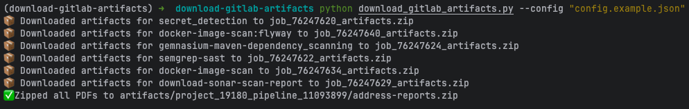
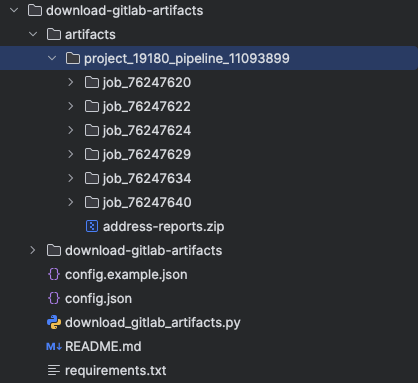

# Download GitLab Artifacts

## Description
This script downloads artifacts from a GitLab CI job using the GitLab API. It requires a personal access token and the project ID of the GitLab project.

## Prerequisite

- Generate a personal access token with `api` and `read_api` scope from your GitLab account
- Prepare the configuration file `config.json` with the following structure:
   ```json
   [
     {
       "pipeline_id": "<pipeline_id>",
       "project_id": "<your_project_id_of_the_repository>",
       "pdf_prefix": "<some_prefix_for_pdf_files>",
       "job_names": [
         "<job_name_1_with_artifacts>",
         "<job_name_2_with_artifacts>",
         "<job_name_3_with_artifacts>"
       ]
     }
   ]
   ```

Refer to this [example config file](config.example.json).

## Notes

- Pipeline artifacts have expiration dates, so they may not be available indefinitely.

## How to use

1. Set environment variables in your zshrc and source it afterwards:
   ```bash
   export GITLAB_TOKEN="your_gitlab_token"
   export GITLAB_BASE_URL="your_gitlab_base_url"
   ```
2. Create virtual environment (skip if you already have one):
   ```bash
   python -m venv download-gitlab-artifacts
   ```
   This will create a directory named `download-gitlab-artifacts` in your current directory.
3. Activate the virtual environment:
   ```bash
   source download-gitlab-artifacts/bin/activate
   ```
4. Install the required packages:
   ```bash
   pip install -r requirements.txt
   ```
5. Run the script with the required parameters:
   ```bash
   python download_gitlab_artifacts.py --config "config.json"
   ```
6. The script will download the artifacts under `artifacts`, if no other name is passed via the argument `--output <output_folder>`.

Sample output:



Project folder:



